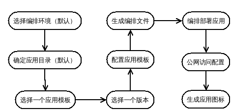

软件市场应用管理设计
=================

## 前言
### 文档概述
本文给出软件市场项目中应用管理部分设计，包括概要设计，SDK设计以及各模块详细设计。

### 基本概念

- **Application:** 应用程序；
- **Stack:** 这里指应用栈，这里表示已安装应用；
- **Template:** 这里指应用模板，代表一个应用软件，可以有多个版本；
- **Enviroment:** 这里指应用的编排部署环境；
- **Catalog:** 应用目录，每个目录包含多个应用模板。

## 需求分析

### 功能需求
 
1. 支持软件市场分类搜索查看；
2. 支持软件安装、升级、卸载和查询。
3. 支持多个编排部署环境（如本地部署或远程部署）；


## 概要设计

### 领域模型


### 设计框架图


## 详细设计

### 部署环境管理设计
部署环境管理，主要功能如下：
1. 可以支持多个不同类型的编排部署工具进行管理。
2. 每一种类型的编排工具对应一个驱动。
3. 自动生成一个默认环境，该环境使用一个默认部署驱动。


### 应用栈管理设计

应用管理包括应用创建、版本更新，应用查询等，接下来描述应用创建和更新流程。

#### 应用创建流程




#### 应用更新流程
应用更新 主要是通过编排部署系统来实现，应用管理系统主要负责提供新的编排文件。

1. 获取但前应用栈的应用模板以及版本信息(repo:catalog:template:version)；
2. 获取应用模板最新版本信息；
3. 比较两者版本信息，如果最新版本较大则执行以下操作，否则退出；
4. 选择最新版本，并配置并生成编排文件；
5. 编排部署应用。

### 应用模板管理设计
应用模板管理包括如下两部分：
1. 应用市场服务源管理，默认接入公有云软件市场模板；
2. 统一应用模板提供；


## SDK设计

### 应用管理服务API设计

### ApplicationStackService

```java
public interface ApplicationStackService
{
    public ApplicationStackView deploy(String stackName, String templateVersionId, StackConfigView config) throws
            CaaSServiceException, IOException;

    public void destroy(String stackName) throws CaaSServiceException, IOException;

    public void update(String stackName, String templateVersionId, StackConfigView config) throws
            CaaSServiceException, IOException;

    public ApplicationStackView stop(String stackName) throws
            CaaSServiceException, IOException;

    public ApplicationStackView start(String stackName) throws
            CaaSServiceException, IOException;
}
```
### CatalogService

```java
public interface CatalogService
{
    public ApplicationTemplateView[] listTemplates() throws CaaSServiceException, IOException;

    public TemplateVersionView[] listTemplateVersions() throws CaaSServiceException, IOException;

    public CatalogView[] listCatalogs() throws CaaSServiceException, IOException;

    public TemplateVersionView find(String versionId) throws CaaSServiceException, IOException;
}
```
### EnviromentService
编排部署环境管理服务API

```java
public interface EnviromentService
{
    public EnviromentView register(String envName, StackDriverView driver, EnviromentConfig config) throws 
            CaaSServiceException, IOException;

    public EnviromentView update(String envName, EnviromentConfig config) throws CaaSServiceException, IOException;

    public void release(String envName) throws CaaSServiceException, IOException;
}
```

## 数据库设计

`caas-app-manager-init.sql`
```
CREATE TABLE `caas_enviroment`(
    `id` bigint(20) NOT NULL AUTO_INCREMENT,
    `uuid` varchar(128) NOT NULL,
    `created` datetime DEFAULT NULL,
    `removed` datetime DEFAULT NULL,
    `removeTime` datetime DEFAULT NULL,    
    `name` varchar(255) DEFAULT NULL,
    `description` varchar(1024) DEFAULT NULL,
    `state` varchar(128) NOT NULL COMMENT 'active,inactive,removed',
    `driverId` bigint(20) DEFAULT NULL,
    `configData` text,
    PRIMARY KEY (`id`),
    UNIQUE KEY `idx_caas_enviroment_uuid`(`uuid`)
);

CREATE TABLE `caas_stack_driver`(
    `id` bigint(20) NOT NULL AUTO_INCREMENT,
    `uuid` varchar(128) NOT NULL,
    `created` datetime DEFAULT NULL,
    `removed` datetime DEFAULT NULL,
    `removeTime` datetime DEFAULT NULL,    
    `mainClass` varchar(255) DEFAULT NULL,
    `data` text,
    PRIMARY KEY (`id`),
    UNIQUE KEY `idx_caas_stack_driver_uuid`(`uuid`)
);


CREATE TABLE `caas_stack`(
    `id` bigint(20) NOT NULL AUTO_INCREMENT,
    `uuid` varchar(128) NOT NULL,
    `created` datetime DEFAULT NULL,
    `updated` datetime DEFAULT NULL,
    `removed` datetime DEFAULT NULL,
    `removeTime` datetime DEFAULT NULL,
    `name` varchar(255) DEFAULT NULL,
    `endpoint`  varchar(255) DEFAULT NULL,
    `enviromentId` bigint(20) DEFAULT NULL,
    `state` varchar(255) DEFAULT NULL COMMENT 'creating,running,stopped,removed',
    `versionId` varchar(255) DEFAULT NULL COMMENT 'template version',
    `data` text,
    PRIMARY KEY (`id`),
    UNIQUE KEY `idx_caas_stack_driver_uuid`(`uuid`)
);

```