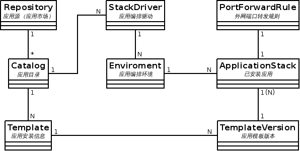

软件市场应用管理设计
=================

## 前言
### 文档概述
本文给出软件市场项目中应用管理部分设计，包括概要设计，SDK设计以及各模块详细设计。

### 基本概念

- **Application:** 应用程序；
- **Stack:** 这里指应用栈，这里表示已安装应用；
- **Template:** 这里指应用模板，代表一个应用软件，可以有多个版本；
- **Enviroment:** 这里指应用的编排部署环境；
- **Catalog:** 应用目录，每个目录包含多个应用模板。

## 需求分析

### 功能需求
 
1. 支持软件市场分类搜索查看；
2. 支持软件安装、升级、卸载。


## 领域模型

 

## 设计框架图


### 应用创建流程图


## SDK设计

### ApplicationStackService

```
ApplicationStackService

```

## 数据库设计

`caas-app-manager-init.sql`
```
CREATE TABLE `caas_enviroment`(
    `id` bigint(20) NOT NULL AUTO_INCREMENT,
    `uuid` varchar(128) NOT NULL,
    `name` varchar(255) DEFAULT NULL,
    `driverId` bigint(20) DEFAULT NULL,
    PRIMARY KEY (`id`),
    UNIQUE KEY `idx_caas_enviroment_uuid`(`uuid`)
);

CREATE TABLE `caas_stack_driver`(
    `id` bigint(20) NOT NULL AUTO_INCREMENT,
    `uuid` varchar(128) NOT NULL,
    PRIMARY KEY (`id`),
    UNIQUE KEY `idx_caas_stack_driver_uuid`(`uuid`)
);

DROP TABLE IF EXISTS `load_balancer`;
/*!40101 SET @saved_cs_client     = @@character_set_client */;
/*!40101 SET character_set_client = utf8 */;
CREATE TABLE `load_balancer` (
  `id` bigint(20) NOT NULL AUTO_INCREMENT,
  `name` varchar(255) DEFAULT NULL,
  `account_id` bigint(20) DEFAULT NULL,
  `kind` varchar(255) NOT NULL,
  `uuid` varchar(128) NOT NULL,
  `description` varchar(1024) DEFAULT NULL,
  `state` varchar(128) NOT NULL,
  `created` datetime DEFAULT NULL,
  `removed` datetime DEFAULT NULL,
  `remove_time` datetime DEFAULT NULL,
  `data` mediumtext,
  `global_load_balancer_id` bigint(20) DEFAULT NULL,
  `weight` bigint(20) DEFAULT NULL,
  `load_balancer_config_id` bigint(20) DEFAULT NULL,
  `service_id` bigint(20) DEFAULT NULL,
  PRIMARY KEY (`id`),
  UNIQUE KEY `idx_load_balancer_uuid` (`uuid`),
  KEY `fk_load_balancer__account_id` (`account_id`),
  KEY `fk_load_balancer__global_load_balancer_id` (`global_load_balancer_id`),
  KEY `idx_load_balancer_name` (`name`),
  KEY `idx_load_balancer_remove_time` (`remove_time`),
  KEY `idx_load_balancer_removed` (`removed`),
  KEY `idx_load_balancer_state` (`state`),
  KEY `fk_load_balancer__load_balancer_config_id` (`load_balancer_config_id`),
  KEY `fk_load_balancer__service_id` (`service_id`),
  CONSTRAINT `fk_load_balancer__account_id` FOREIGN KEY (`account_id`) REFERENCES `account` (`id`) ON DELETE NO ACTION ON UPDATE NO ACTION,
  CONSTRAINT `fk_load_balancer__global_load_balancer_id` FOREIGN KEY (`global_load_balancer_id`) REFERENCES `global_load_balancer` (`id`) ON DELETE NO ACTION ON UPDATE NO ACTION,
  CONSTRAINT `fk_load_balancer__load_balancer_config_id` FOREIGN KEY (`load_balancer_config_id`) REFERENCES `load_balancer_config` (`id`) ON DELETE NO ACTION ON UPDATE NO ACTION,
  CONSTRAINT `fk_load_balancer__service_id` FOREIGN KEY (`service_id`) REFERENCES `service` (`id`) ON DELETE NO ACTION ON UPDATE NO ACTION
) ENGINE=InnoDB DEFAULT CHARSET=utf8;

```