Rancher 调研报告
===============

## Rancher与容器云平台（CaaS）

### 容器云平台特性

1. 高密度 高弹性；

2. 兼具IaaS的灵活和PaaS的便利；


## Rancher 使用介绍

- Rancher是一个开源的、全面的容器部署及管理平台。

- Rancher 除了自生提供调度服务(Cattle)，在Rancher1.0后,同时集成了Kubernetes、Mesos以及Swarm三种调度服务，可以在这几种调度服务环境任意选择。

- Rancher提供一揽子全栈化容器运行和管理平台，为容器提供全栈化的基础架构服务，包括网络服务，存储服务，主机（物理机或者虚拟机）管理，负载均衡等等

### Rancher 部署
Rancher所有的服务都是运行在Container中。

**部署Rancher Server**
- 在HOST(192.168.1.122)上安装Docker engine；
- 执行如下命令（下载rancher/server镜像，并启动rancher-server服务）

```
$ sudo docker run -d --restart=unless-stopped -p 8080:8080 rancher/server
# Tail the logs to show Rancher
$ sudo docker logs -f containerid
```


- 通过 http://192.168.1.122:8080/ 进入管理页面，即成功部署；
- Server部署完成之后，默认创建名为Default的环境（使用cattle编排），可以按照提示步骤部署主机或者新增环境。


### 环境管理

Rancher 支持将资源分组归属到多个环境中。每个环境具有自己独立的基础架构资源及服务，并由一个或多个用户、团队或组织所管理。

支持 Cattle, Kubernetes、Mesos以及Swarm 四种类型的编排服务，在选择各个编排服务无需作额外的手动部署。

在 环境添加完成之后，可以独立为每个环境添加主机

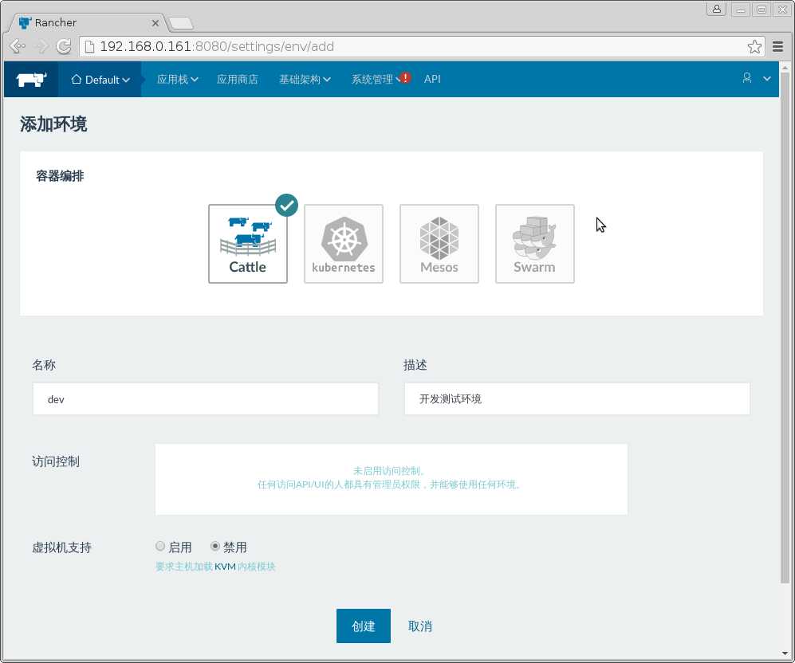

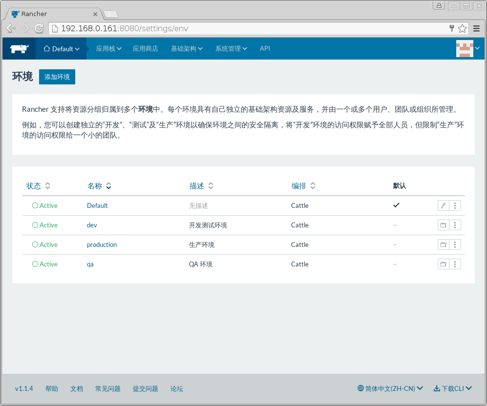


### 主机管理与主机驱动

- 支持多种节点添加与部署模式，支持docker-machine方式部署节点;
- 提供主机驱动管理，可以添加docker-machine驱动；

- 添加的主机 需要满足 支持 Docker v1.10.3 或以上版本的Linux主机，该主机需要能够通过HTTP方式访问Rancher 服务器

- 可以是任何共有云、私有云等方式提供的主机。

- 对于自定义模式，只需要在Docker节点上执行如下命令即可注册；
```
sudo docker run -d --privileged -v /var/run/docker.sock:/var/run/docker.sock -v /var/lib/rancher:/var/lib/rancher rancher/agent:v1.0.2 http://192.168.0.161:8080/v1/scripts/1E71D5C8C7AC71E850EC:1475222400000:bpO9xt4coI611r7GaI1zUxKjrI
```
- 主机管理，可以方便查看主机信息以及统计数据（CPU、MEMORY、 网络、存储），可以对主机进行操作。

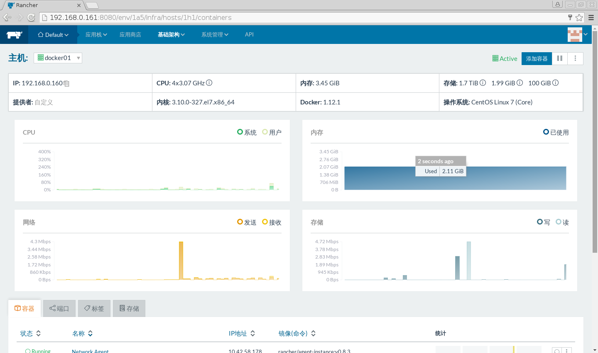


### 访问控制

支持接入多类帐号，AD， Azure AD，GITHUB，LOCAL，OpenLDAP，
其中LOCAL 为设置通过本地帐号密码登陆，OpenLDAP需要设置LDAP服务器

### 存储管理

在Docker中支持通过Volume插件来管理 NFS，Glusterfs等分布式存储，Rancher 目前提供
官方提供Convoy 插件来进行分布式卷管理。

- 可以通过步骤 `应用商店 --> 选取Convoy NFS --> 配置NFS Server信息 --> 创建应用` 来快捷创建卷管理服务。

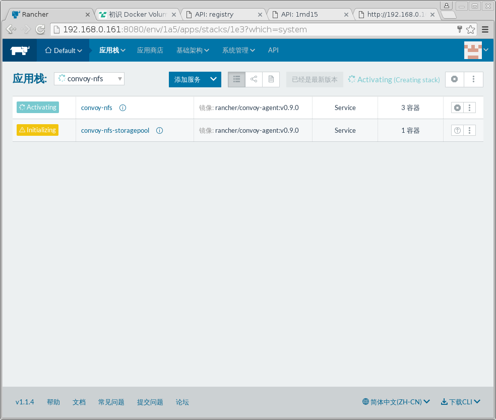

- 添加完成之后，在存储管理既可以在该卷管理驱动(convoy-nfs)上新增或删除卷。
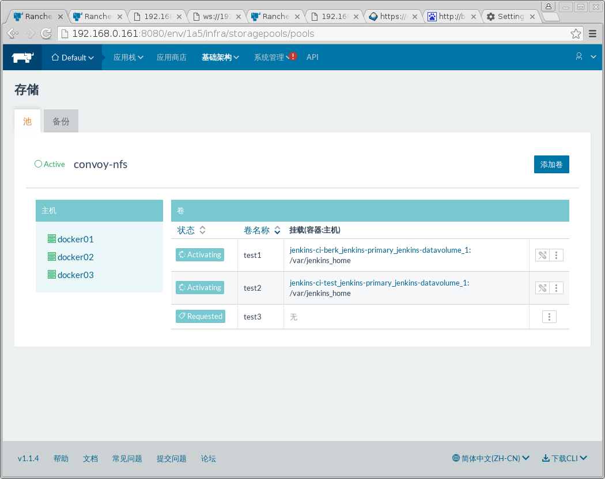

- 同时可以在HOST 上查看卷信息

```
[root@docker01 server]# docker volume list
DRIVER              VOLUME NAME
local               6e5330913852b6375c76fc5b3b299b599b58e07e795db31f0a670851a17d9948
local               a833d5a62958072329802e81f49a2c42c839e5e52cf6fb25df55942fce6a9569
convoy-nfs          test1
convoy-nfs          test2
convoy-nfs          test3

```

- 在创建需要卷的容器时，填写相关的卷名称即可。

### 镜像库管理与容器创建
- 以下页面统一管理私有镜像库

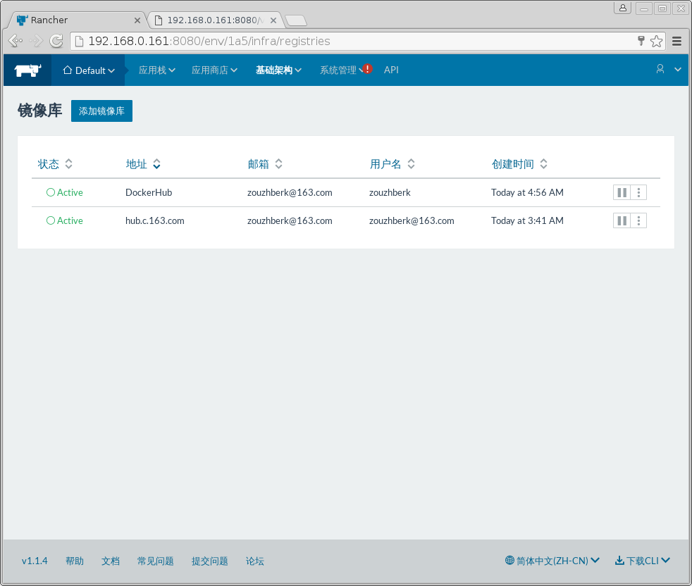

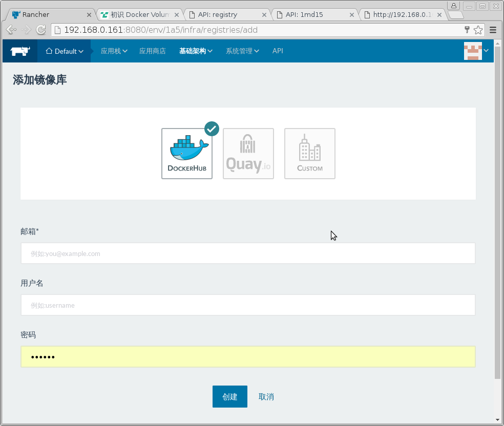

- 在添加完成之后，进入容器管理页面点击添加容器

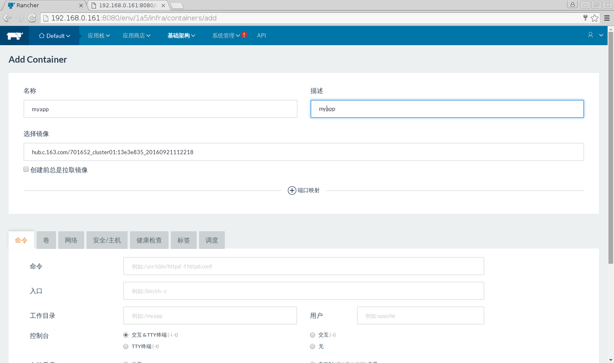

- 在选择镜像输入 镜像名称信息
> 如果为私有镜像则格式为 [镜像中心网站,默认为index.docker.io]/[用户名]/<镜像名>:[标签，默认为latest]
如：hub.c.163.com/zouzhberk/701652_cluster01:13e3e835_20160921112218

> 如果为公共镜像则格式为[镜像中心网站,默认为index.docker.io]/<镜像名>:[标签，默认为latest]

- 根据镜像要求设置存储，环境变量，网络信息等即可创建，在创建容器时，也可以设置失败重启策略。

### 容器管理
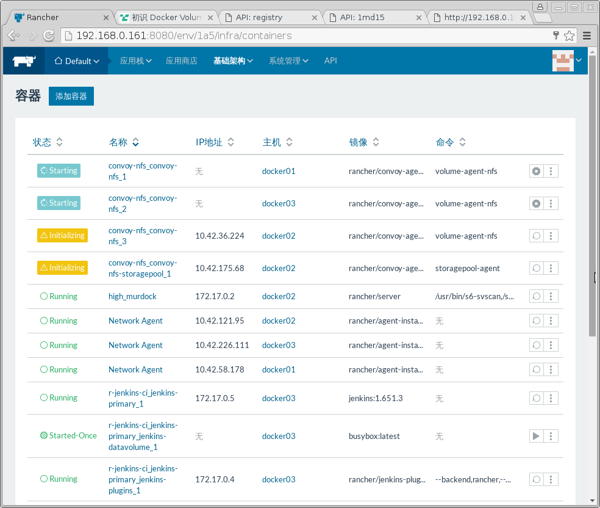
- 其中状态为Started-Once的容器表示执行任务之后自动停止的容器；

- 可以此界面对容器进行启动停止删除，进入容器命令行，查看在线日志等操作。

- 点击容器进入详细管理页面,在此页面可以查看更详细的统计信息(CPU,MEMORY,网络，存储),卷和端口信息，也可以对此容器进行操作。

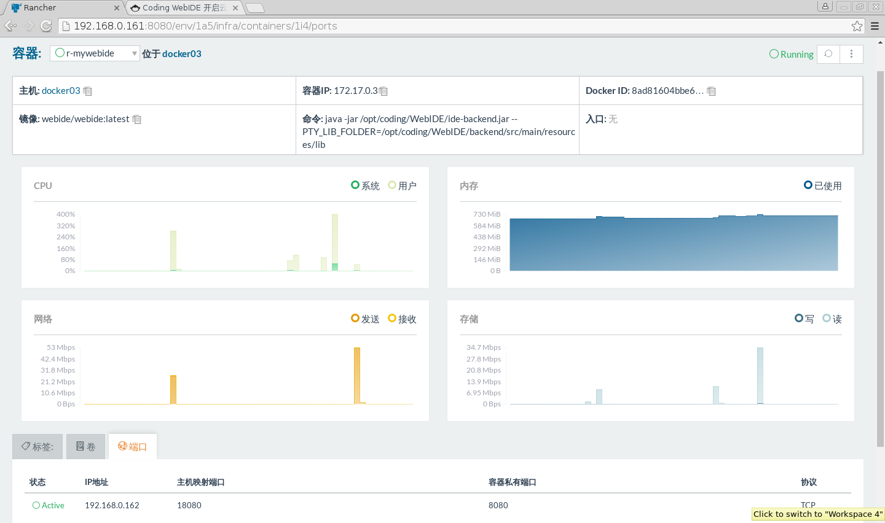


### 应用商店设置
应用商店分以下两类，
- 官方认证源，应用带有官方标签，来源于 https://github.com/rancher/rancher-catalog.git

- 非官方认证，默认提供 社区贡献源, 来源于 https://github.com/rancher/community-catalog.git ；
同时支持 自定义应用源，可以添加多个，在系统同步(`git clone`)完成之后即可使用。

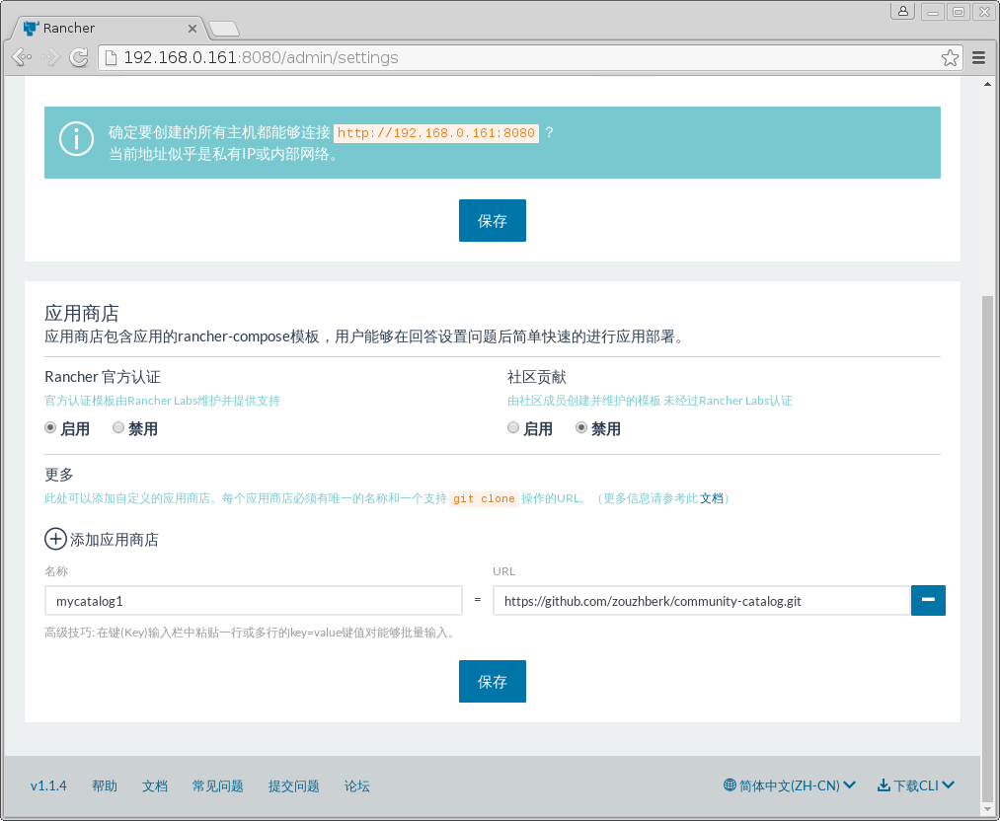

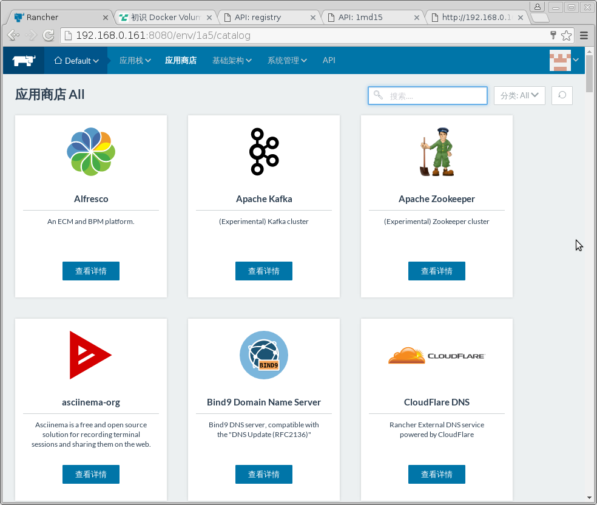

### 应用栈（Stack）创建与管理


`docker-compose.yml`
```
jenkins-primary:
  image: "jenkins:1.651.3"
  ports:
    - "${PORT}:8080"
  labels:
    io.rancher.sidekicks: jenkins-plugins,jenkins-datavolume
    io.rancher.container.hostname_override: container_name
  volumes_from:
    - jenkins-plugins
    - jenkins-datavolume
  entrypoint: /usr/share/jenkins/rancher/jenkins.sh
jenkins-plugins:
  image: rancher/jenkins-plugins:v0.1.1
jenkins-datavolume:
  image: "busybox"
  volumes:
    - ${volume_work}:/var/jenkins_home
  labels:
    io.rancher.container.start_once: true
  entrypoint: ["chown", "-R", "1000:1000", "/var/jenkins_home"]
```
`rancher-compose.yml` 
```
.catalog:
  name: Jenkins
  version: 1.651.3-rancher1
  description: |
    Jenkins CI management server.
  questions:
  - variable: "PORT"
    type: "int"
    label: "Port Number"
    description: "Which port should Jenkins listen on?"
    default: 8080
    required: true
  - variable: "volume_work"
    description: "Work volume to save jenkins data"
    label: "Work volume:"
    required: true
    default: "/var/lib/docker/jenkins-ci"
    type: "string"
  - variable: "plugins"
    type: "multiline"
    label: "List of Plugins"
    description: |
      List of plugins in the format <plugin_name>[:<version>]
      one entry per line.
    default: |
      credentials
      git
      git-client
      github
      github-api
      github-oauth
      greenballs
      junit
      plain-credentials
      scm-api
      ssh-credentials
      ssh-slaves
      swarm
jenkins-primary:
  metadata:
    plugins: |
      ${plugins}
```

`answers.txt`
```
PORT=8080
volume_work=test1
plugins='credentials
git
git-client
github
github-api
github-oauth
greenballs
junit
plain-credentials
scm-api
ssh-credentials
ssh-slaves
swarm
'
``` 

## Rancher 编排系统介绍
Rancher 原生使用 Cattle 编排框架.
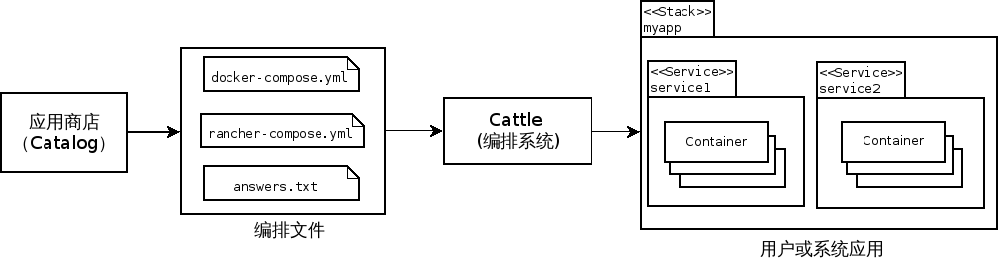

### Docker Compose


### Rancher Metadata 服务 与应用配置

https://github.com/rancher/rancher-metadata

```
curl -H 'Acccept: application/json' http://rancher-metadata/2015-12-19/self/container/create_index
curl http://rancher-metadata/latest/self/container/primary_ip
```
> [Confd与Rancher-metadata 结合的妙用](http://niusmallnan.github.io/_build/html/_templates/rancher/confd_metadata.html)


## Rancher 设计介绍

### Rancher 部署架构
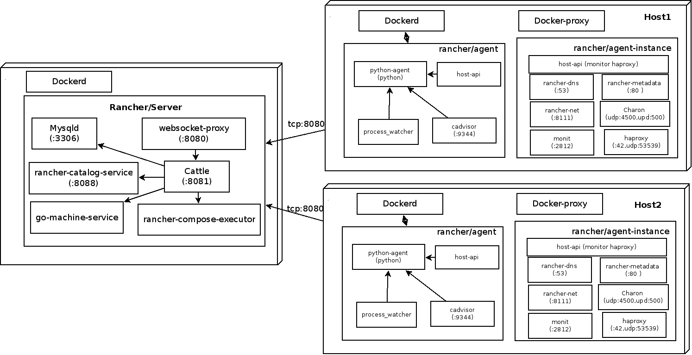

### Rancher Server

- rancher/dind
    - image: https://store.docker.com/community/images/rancher/dind
    - source: https://github.com/rancher/docker-dind-base


- websocket-proxy

    - source:https://github.com/rancher/websocket-proxy

- rancher/server
    - image: https://store.docker.com/community/images/rancher/server
    - source: https://github.com/rancher/rancher/tree/master/server

- rancher-catalog-service 
 
    - source【GO】:https://github.com/rancher/rancher-catalog-service
- go-machine-service
  - source[GO]: 

```
// - giddyup
//     - Giddyup is a tool to that helps get services started in a Rancher compose stack. It aims to simplify entrypoint and command scripting to start your Docker services.
//     - source【GO】: https://github.com/cloudnautique/giddyup
```
### rancher-catalog-service

  - rancher-catalog-service gets deployed as a Rancher service containerized app.

  - rancher-catalog-service will clone a git repo (e.g. a public github repo) and provide API to list and navigate through the templates and subversions from the repo

  - The service will periodically sync changes from the repo

  - The UI integrated with the service will enable the user to view the templates in a catalog format and also launch a template to a specified rancher deployment.

### rancher-compose-executor/racher-compose(New Version )
source[GO] :https://github.com/rancher/rancher-compose-executor
merge to source[GO] : https://github.com/rancher/rancher-compose


## rancher-agent
```
root      5061  2879  2 04:19 ?        00:10:47 python /var/lib/cattle/pyagent/main.py
root      5340  5061  0 04:19 ?        00:00:04 /bin/bash /var/lib/cattle/pyagent/cattle/process_watcher.sh
root      5347  5061  0 04:19 ?        00:01:03 host-api -cadvisor-url http://127.0.0.1:9344 -logtostderr=true -ip 0.0.0.0 -port 9345 -auth=true -host-uuid ac2f0bd2-63d4-49bd-89ae-4a3f64bd52b8 -public-key /var/lib/cattle/etc/cattle/api.crt -cattle-url http://192.168.0.161:8080/v1 -cattle-state-dir /var/lib/rancher/state/containers
root      5351  5061  0 04:19 ?        00:00:00 /bin/bash /var/lib/cattle/bin/cadvisor.sh cadvisor -logtostderr=true -listen_ip 127.0.0.1 -port 9344 -housekeeping_interval 1s -docker_root /var/lib/docker
```
## rancher-agent-instance

```
root@4528bc661ce7:/# ps -ef
UID        PID  PPID  C STIME TTY          TIME CMD
root         1     0  0 Oct08 ?        00:00:00 init  
root       730     1  0 Oct08 ?        00:01:01 /var/lib/cattle/bin/rancher-metadata -log /var/log/rancher-metadata.log -answers /var/lib/cattle/etc/cattle/me
root       818     1  0 Oct08 ?        00:00:40 /var/lib/cattle/bin/rancher-dns -log /var/log/rancher-dns.log -answers /var/lib/cattle/etc/cattle/dns/answers.
root      1027     1  0 Oct08 ?        00:01:22 /usr/bin/monit -Ic /etc/monit/monitrc
root      1079     1  0 Oct08 ?        00:03:23 /var/lib/cattle/bin/host-api -log /var/log/haproxy-monitor.log -haproxy-monitor -pid-file /var/run/haproxy-mon
root      1090     1  0 Oct08 ?        00:02:50 /usr/local/sbin/charon
root      1143     1  0 Oct08 ?        00:04:28 /var/lib/cattle/bin/rancher-net --log /var/log/rancher-net.log -f /var/lib/cattle/etc/cattle/ipsec/config.json
haproxy  27822     0  0 Oct10 ?        00:00:32 haproxy -p /var/run/haproxy.pid -f /etc/healthcheck/healthcheck.cfg -sf 27753
root     28828  1027  0 Oct10 ?        00:00:00 [logrotate] <defunct>
root     28869     0  0 02:06 ?        00:00:00 /bin/bash

```

### https://github.com/rancher/host-api


### https://github.com/rancher/python-agent


## 目前问题

http://www.cnblogs.com/zhengyun_ustc/p/dockerstack.html


MuqLyE4prXzHEw5ZjqMw3rkHTaXPE5FaSC6xSvmT 
MuqLyE4prXzHEw5ZjqMw3rkHTaXPE5FaSC6xSvmT 
AYns9PhVKskY3ZRyYh5phZ4QFTvCoigFqu5cvX3J 


