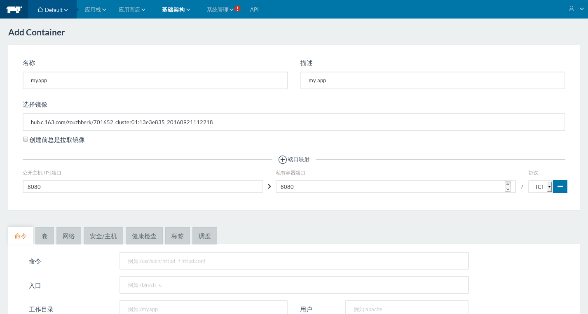

Rancher 调研报告
===============

## Rancher与容器云平台（CaaS）

### 容器云平台特性

1. 高密度 高弹性；

2. 兼具IaaS的灵活和PaaS的便利；


## Rancher 功能介绍

- Rancher是一个开源的、全面的容器部署及管理平台。

- Rancher 除了自生提供调度服务(Cattle)，在Rancher1.0后,同时集成了Kubernetes、Mesos以及Swarm三种调度服务，可以在这几种调度服务环境任意选择。

- Rancher提供一揽子全栈化容器运行和管理平台，为容器提供全栈化的基础架构服务，包括网络服务，存储服务，主机（物理机或者虚拟机）管理，负载均衡等等

### Rancher 部署
Rancher所有的服务都是运行在Container中。

**部署Rancher Server**
- 在HOST(192.168.1.122)上安装Docker engine；
- 执行如下命令（下载rancher/server镜像，并启动rancher-server服务）

```
$ sudo docker run -d --restart=unless-stopped -p 8080:8080 rancher/server
# Tail the logs to show Rancher
$ sudo docker logs -f containerid
```
- 通过 http://192.168.1.122:8080/ 进入管理页面，即成功部署；
- Server部署完成之后，默认创建名为Default的环境（使用cattle编排），可以按照提示步骤部署主机或者新增环境。


### 环境管理

Rancher 支持将资源分组归属到多个环境中。每个环境具有自己独立的基础架构资源及服务，并由一个或多个用户、团队或组织所管理。

支持 Cattle, Kubernetes、Mesos以及Swarm 四种类型的编排服务，在选择各个编排服务无需作额外的手动部署。

在 环境添加完成之后，可以独立为每个环境添加主机


### 主机管理与主机驱动

- 支持多种节点添加与部署模式，支持docker-machine方式部署节点;
- 提供主机驱动管理，可以添加docker-machine驱动；

- 对于自定义模式，只需要在Docker节点上执行如下命令即可注册；
```
sudo docker run -d --privileged -v /var/run/docker.sock:/var/run/docker.sock -v /var/lib/rancher:/var/lib/rancher rancher/agent:v1.0.2 http://192.168.0.161:8080/v1/scripts/1E71D5C8C7AC71E850EC:1475222400000:bpO9xt4coI611r7GaI1zUxKjrI
```
- 主机管理，可以方便查看主机信息以及统计数据（CPU、MEMORY、 网络、存储），可以对主机进行操作。


### 访问控制

支持接入多类帐号，AD， Azure AD，GITHUB，LOCAL，OpenLDAP，
其中LOCAL 为设置通过本地帐号密码登陆，OpenLDAP需要设置LDAP服务器

### 存储管理

在Docker中支持通过Volume插件来管理 NFS，Glusterfs等分布式存储，Rancher 目前提供
官方提供Convoy 插件来进行分布式卷管理。

- 可以通过步骤 `应用商店 --> 选取Convoy NFS --> 配置NFS Server信息 --> 创建应用` 来快捷创建卷管理服务。


- 添加完成之后，在存储管理既可以在该卷管理驱动(convoy-nfs)上新增或删除卷。


- 在创建需要卷的容器时，填写相关的卷名称即可。

### 镜像库管理与容器创建
- 以下页面统一管理私有镜像库


- 在添加完成之后，进入容器管理页面点击添加容器



- 在选择镜像输入 镜像名称信息
> 如果为私有镜像则格式为 [镜像中心网站,默认为index.docker.io]/[用户名]/<镜像名>:[标签，默认为latest]
如：hub.c.163.com/zouzhberk/701652_cluster01:13e3e835_20160921112218

> 如果为公共镜像则格式为[镜像中心网站,默认为index.docker.io]/<镜像名>:[标签，默认为latest]

- 根据镜像要求设置存储，环境变量，网络信息等即可创建，在创建容器时，也可以设置失败重启策略。

### 容器管理

- 其中状态为Started-Once的容器表示执行任务之后自动停止的容器；

- 可以此界面对容器进行启动停止删除，进入容器命令行，查看在线日志等操作。

- 点击容器进入详细管理页面,在此页面可以查看更详细的统计信息(CPU,MEMORY,网络，存储),卷和端口信息，也可以对此容器进行操作。


### 应用商店设置
应用商店分以下两类，
- 官方认证源，应用带有官方标签，来源于 https://github.com/rancher/rancher-catalog.git

- 非官方认证，默认提供 社区贡献源, 来源于 https://github.com/rancher/community-catalog.git ；
同时支持 自定义应用源，可以添加多个，在系统同步(`git clone`)完成之后即可使用。


### 应用栈（Stack）创建与管理


## Rancher 架构介绍

## 目前问题

http://www.cnblogs.com/zhengyun_ustc/p/dockerstack.html


MuqLyE4prXzHEw5ZjqMw3rkHTaXPE5FaSC6xSvmT 
MuqLyE4prXzHEw5ZjqMw3rkHTaXPE5FaSC6xSvmT 
AYns9PhVKskY3ZRyYh5phZ4QFTvCoigFqu5cvX3J 


